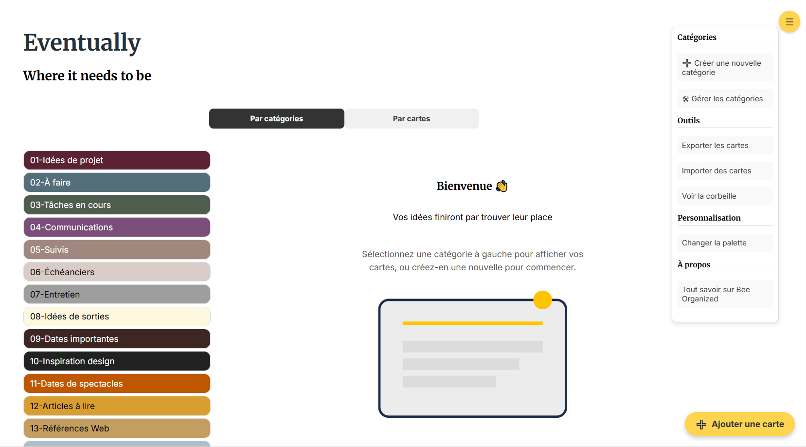

# 👋 Salut, je suis Jean-François Duval

Intégrateur web passionné par l’UX, les outils intelligents et la clarté visuelle.  
Solide expérience avec Looker Studio, GA4, HTML/CSS, javascript, TYPO3 et une attention constante à l’accessibilité web

---

## 🛠️ Compétences techniques

- **Frontend** : HTML5, CSS3 (BEM, Flexbox, Grid), JavaScript (vanilla), Responsive Design
- **CMS** : TYPO3, WordPress (bases), Formspree, connaissances de base en PHP
- **Outils d'analyse** : Google Analytics 4, Looker Studio (avancé), UTM, suivi des événements
- **Outils** : Git, GitHub, Suite Adobe
- **Accessibilité** : conformité WCAG, tables accessibles, structure sémantique claire

---

## 🧪 Projet personnel phare : Outil de gestion de notes et catégories

Développement complet d’une application web de prise de notes :
- 💾 Stockage local avec **IndexedDB**
- 🧱 Architecture modulaire (cartes, catégories, filtres, corbeille…)
- 🎨 Interface responsive et personnalisée
- 🧭 UX structurée pour adaptation mobile / desktop
- 🔧 Filtres dynamiques, import/export JSON, choix de couleurs, gestion de la corbeille

> 🔗 [Voir le dépôt du projet](https://github.com/jeffduval1/eventually)  
> 📎 Bientôt disponible en version hébergée

---

## 🔍 Ce que je recherche actuellement

🎯 Un nouveau défi en tant qu’**intégrateur web** ou **spécialiste UX**  
🤝 De préférence dans un environnement stimulant, avec une culture humaine  
🌐 Télétravail, mode hybride ou contrat public / parapublic  
🧠 Projets stimulants valorisant la qualité du produit et le souci du détail

---

## 📫 Me contacter

- ✉️ [jfduval.web@outlook.com](mailto:jfduval.web@outlook.com)
- 💼 [Mon profil LinkedIn](https://www.linkedin.com/in/jeanfrancoisduval)
- 🌐 [Mon portfolio](https://github.com/jeffduval1/portfolio))

---
